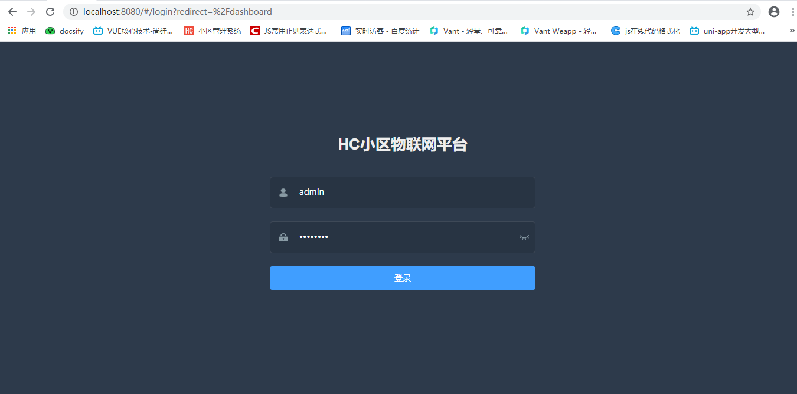
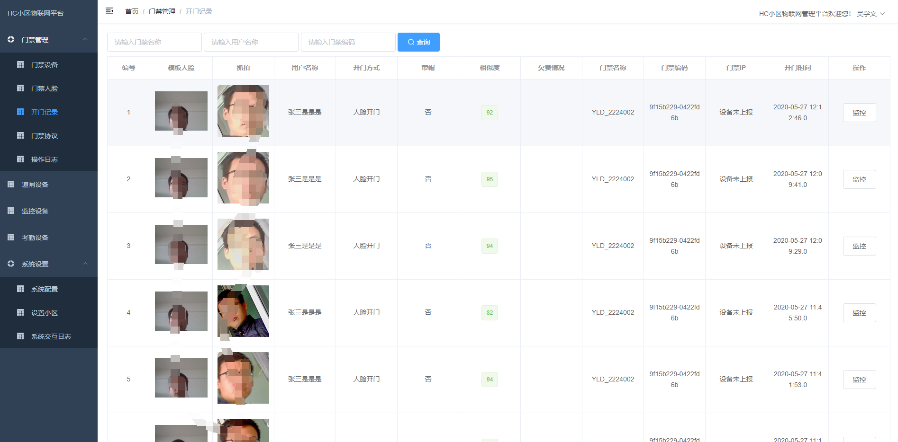
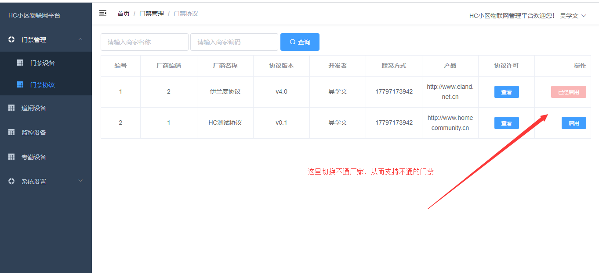

# HC小区物联网平台是前后端完全开源并免费商用的物联网平台，前段采用主流vue+elementui+admin 后端采用spring boot，项目是特别简单架构容易上手对接自己的硬件，欢饮加群827669685交流

## 1. 代码说明

   back 为后端项目 建议用idea打开（maven项目）

   front 为前段项目 需要安装nodejs 

## 2. 如何安装

### 2.1 前段

	1、安装nodejs

	2、进入到 front 目录下 执行 npm install 安装依赖

	3、启动 npm run dev

	4、浏览器访问 http://localhost:8080

### 2.2 后端

	1、idea 用maven的方式打开back项目

	2、maven 导入包，可以在命令行中执行 mvn clean install

	3、打开src\main\java\com.java110.things.ThingsApplicationStart.java 

	4、运行main方法

## 3. 第三方云平台对接协议

[第三方云平台对接协议](back/docs/api.md)

## 4. 自己门禁对接

[自己门禁对接](back/docs/accessControlInterface.md)

## 5. 相关视频

[https://www.bilibili.com/video/BV1pK4y1t7re](https://www.bilibili.com/video/BV1pK4y1t7re)

## 6. 演示

[http://iot.homecommunity.cn/](http://iot.homecommunity.cn/)

	以下效果图

## 7. 更新日志

[HC物联网系统更新日志](back/ChangeLog.md)