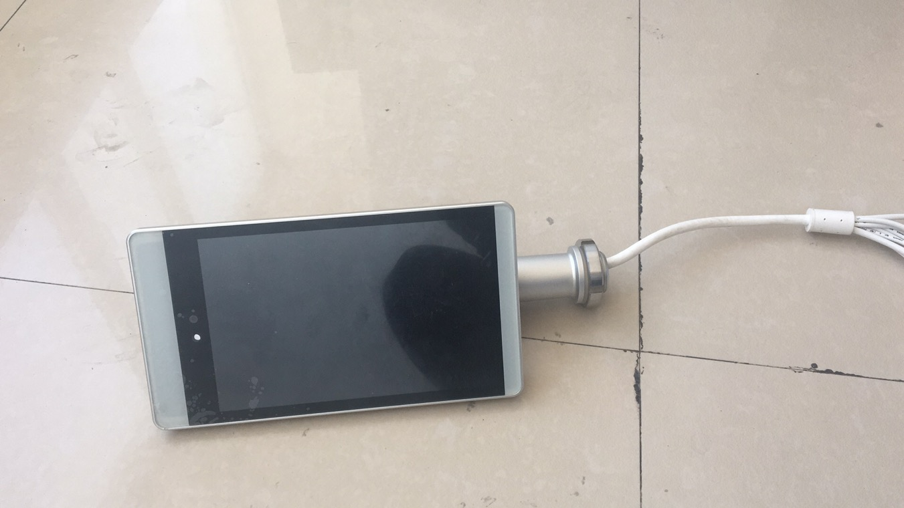
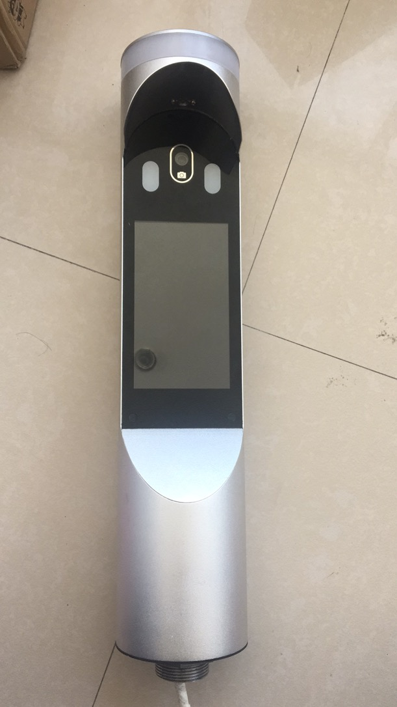
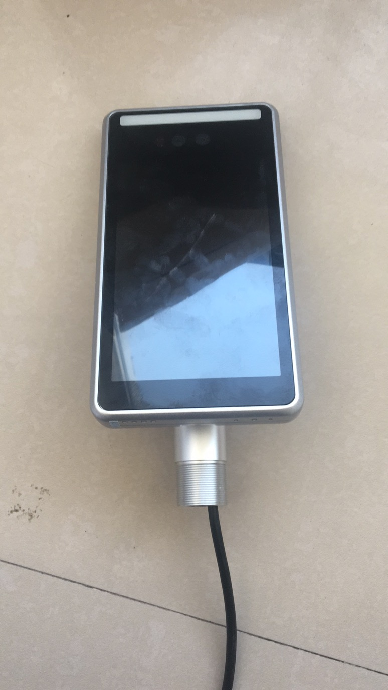
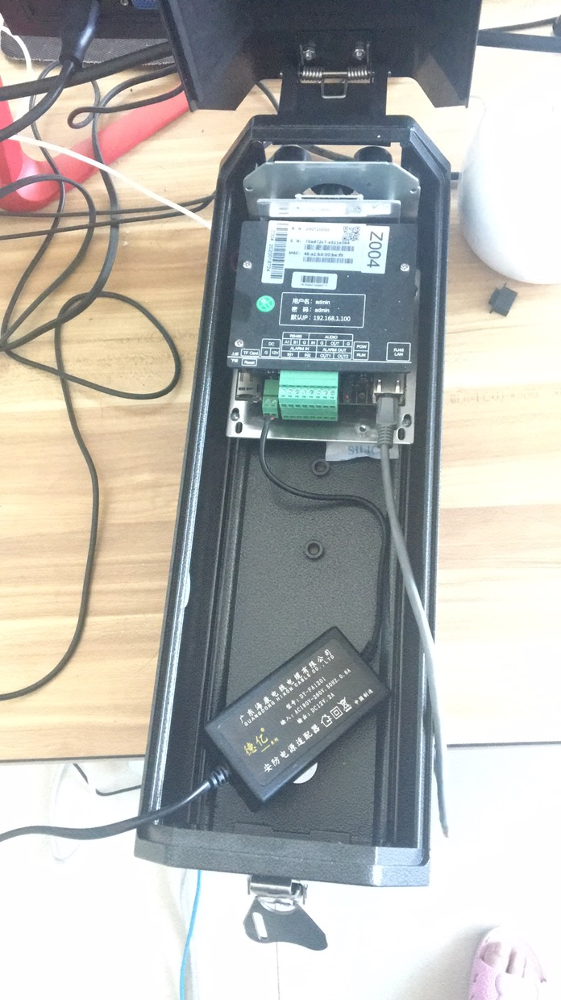
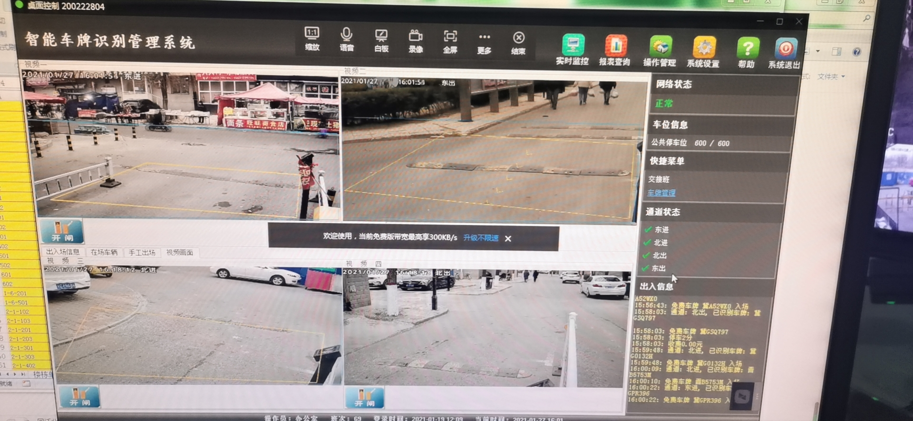
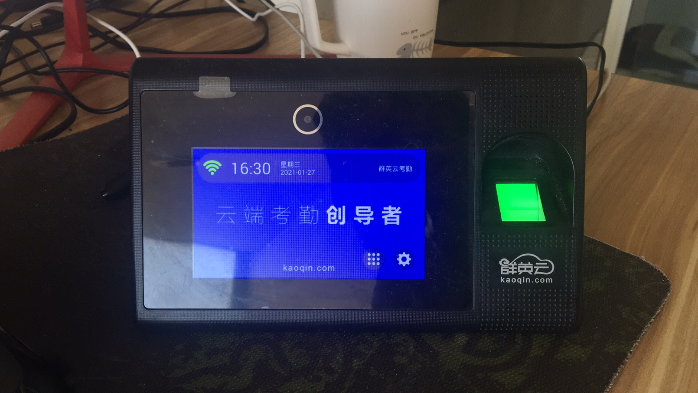

## 已经对接设备

### 门禁对接设备

1、宇泛设备（推荐，已经商用）

设备型号：M38091-0708-R22WF

名称：人脸识别终端

2、伊兰度设备

设备型号：TB20200507-002

名称：伊兰度门禁设备

3、德安设备

设备型号：FS1003-18-N21Q-FDLH-M06

名称：人脸识别一体机

4、百胜智能门禁（第三方平台）

文档：http://www.bisen-iot.com/docs/a45b755218844fd892f230a492cdcf45

### 道闸设备(已经商用)

1、厂家名字未知，系统只写了 车牌识别系统

摄像头 臻识

2、百胜道闸（第三方平台）

http://www.bisen-iot.com/

3、零壹道闸（第三方平台）

http://www.0easy.com/

4、云盟道闸(第三方平台)
	
http://doc.szymzh.com/

### 考勤机

1、群英考勤机

设备信号：2.1_2.0.3
名称：群英云考勤

